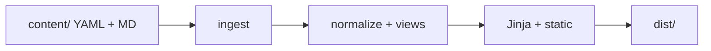

# Resume (static HTML)

YAML and Markdown under `content/` are validated in `ingest/`, then rendered with Jinja into `dist/`.

## Build

```bash
pip install -r requirements.txt
python build.py jinja --sections-file content/site_sections.txt
```

The frontend subcommand is **required** (`jinja` for the static HTML site). Jinja requires an explicit section list: `--sections-file` (see `content/site_sections.txt`) or repeated `--section`. New frontends: add a row to `FRONTEND_MODULES` and implement the hooks in `build.py`’s module docstring. Top-level help: `python build.py -h`. Jinja flags: `python build.py jinja -h`. List: `python build.py list`.

Open `dist/index.html` in a browser (or deploy `dist/` as a static site).

## Ingest



Optional API docs from docstrings: `pip install -r requirements-dev.txt` then `pdoc -o docs-html ingest frontends.jinja.sections.resume`.
